# Device Management Sytem Web Application

This is an improved and enhanced ASP.NET Core Web Application that help keep track of the whereabouts of all IoT devices deployed by the organization.
Each IoT device is initially registered and categorised before being deployed througout the organization building in predefined zones.

## To use the application:
1. Register an account (Dummy Account: username: and password: )
2. Login using the registered username and password
3. Perform Create, Read, Update, and Delete operations on the Categories, Zones, and/or Devices

* Web Application
```url
https://iotdevicemanagementwebapp.azurewebsites.net/
```

## Table of Contents

1. [ Home. ](#home)
2. [ Register. ](#register)
3. [ Login. ](#login)
4. [ Category.](#category)
	1. [Create a new Category](#PostCat)
	2. [Get all Categories](#GetAllCat)
	3. [Get specific Category](#oneCat)
	4. [Update an exisitin Category](#PatchCat)
	5. [Delete a Category](#deleteCat)
5. [ Zones. ](#zone)
	1. [Create a new Zone](#PostZones)
	2. [Get all Zones](#GetAllZones)
	3. [Get specific Zone](#GetOneZone)
	4. [Update an exisitin Zone](#PatchZone)
	5. [Delete a Zone](#deleteZone)
6. [ Device. ](#device)
	1. [Create a new Device](#PostDevice)
	2. [Get all devices](#GetAllDevices)
	3. [Get specific Device](#GetOneDevice)
	4. [Update an exisitin Device](#PatchDevice)
	5. [Delete a Device](#deleteDevice)
	
<a name="home"></a>      
## 1.Home <br>
* The home screen before login <br>


<a name="register"></a>      
## 2.Register <br>
* Create an account with your emailAddress and password <br>
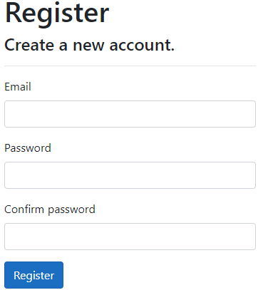

<a name="login"></a>      
## 3.Login <br>
* Login with your registered emailAddress and password <br>
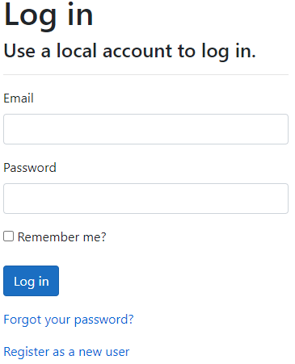


<a name="category"></a>      
## 4.Category <br>
* Perform CRUD operations on Category <br>

<a name="GetAllCat"></a>      
### Get all Categories <br>
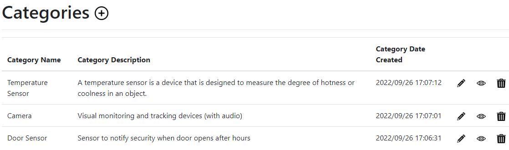

<a name="PostCat"></a>      
### Create a new Category <br>
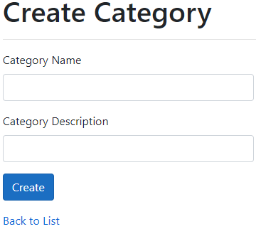

<a name="oneCat"></a>      
### Get specific Category <br>
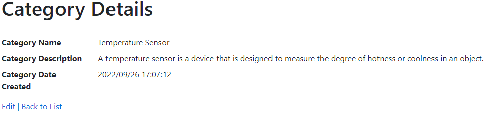

<a name="PatchCat"></a>      
### Update an exisitin Category <br>


<a name="deleteCat"></a>      
### Delete a Category <br>
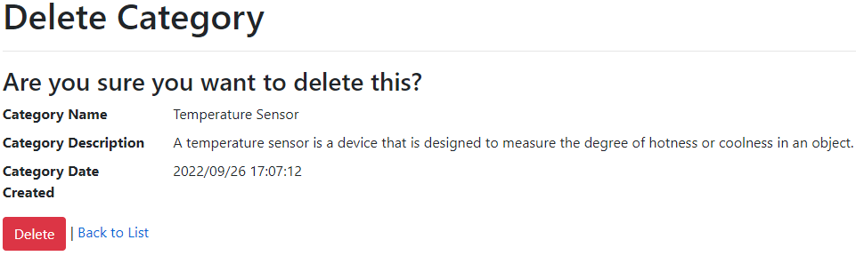


<a name="zone"></a>      
## 5.Zones <br>
* Perform CRUD operations on Zone <br>

<a name="GetAllZones"></a>      
### Get all Zones <br>
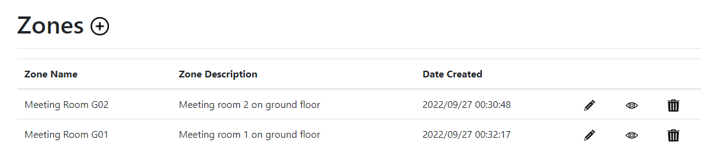

<a name="PostZones"></a>      
### Create a new Zone <br>
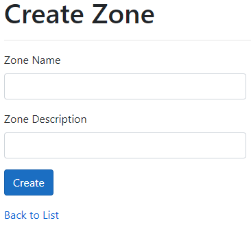

<a name="GetOneZone"></a>      
### Get specific Zone <br>


<a name="PatchZone"></a>      
### Update an exisitin Zone <br>
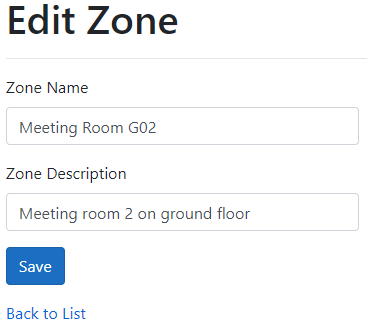

<a name="deleteZone"></a>      
### Delete a Zone <br>
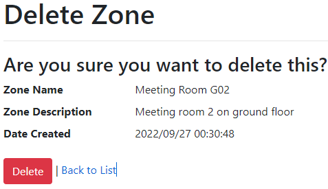


<a name="device"></a>      
## 6.Device <br>
* Perform CRUD operations on Device <br>	

<a name="GetAllDevices"></a>      
### Get all devices <br>
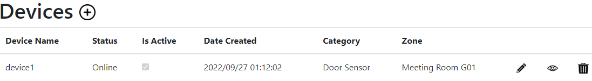

<a name="PostDevice"></a>      
### Create a new Device <br>


<a name="GetOneDevice"></a>      
### Get specific Device <br>
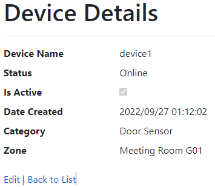

<a name="PatchDevice"></a>      
### Update an exisitin Device <br>
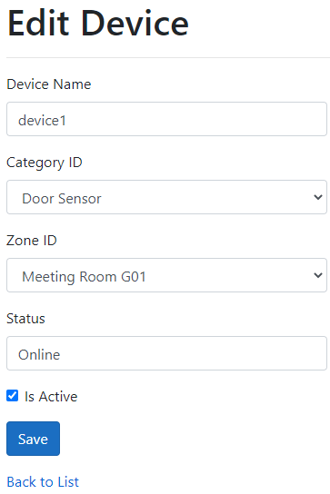

<a name="deleteDevice"></a>      
### Delete a Device <br>
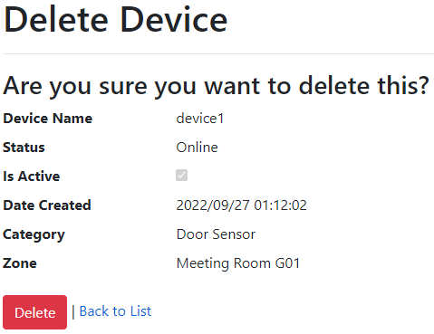

<a name="HaS"></a>
## Help and Support<br>
---
 * marijkec
 * JacquiM